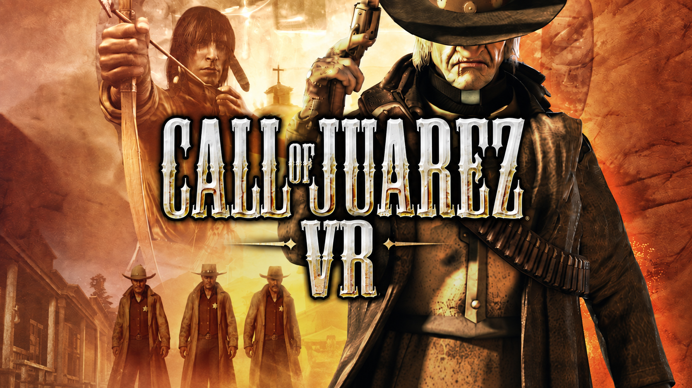

# Call of Juarez VR

<p align="center">
  
</p>

<p align="center">
  
  
  
</p>
<p align="center">
  <a href="https://ko-fi.com/onitaku"></a>
</p>

**An experimental native-PCVR conversion for Techland's Call of Juarez games.**

Call of Juarez (2006) is the reference implementation. The goal is a native-feeling VR conversion with stereo rendering from the game engine, tracked head and hands, full-body integration and interactions rebuilt around motion controllers.

> **Pre-alpha — no public release yet.** Native stereo and the core HMD path are working in-headset. Current development is focused on the remaining playability and comfort blockers before the first backend can be considered usable end to end.

## Current state

Native D3D9 stereo reaches SteamVR with real per-eye rendering, tracked 6DoF head movement, positional camera offset, recentering and VR presentation transitions between menus/loading and gameplay.

PS VR2 Sense tracking already reaches the game-specific hand/body layer.
Physical measurement has confirmed vanilla-equivalent native movement and jump
behavior; their earlier apparent slowdown was presentation cadence. The current
physical gate is a host-tested D3D9Ex shared-texture transport that removes
native-stereo GPU-to-CPU readback. Controller-driven UI, continuous arm IK,
weapon alignment and shutdown remain separate open product areas.

[Validation](docs/VALIDATION.md) records the durable physical acceptance state. Per-run logs, videos, telemetry, agent handoffs and temporary evidence remain local under ignored working directories.

## Games

| Game | Project state |
| --- | --- |
| **Call of Juarez (2006)** | Active reference implementation and current physical-test target. |
| **Call of Juarez: Bound in Blood** | Planned. No Chrome Engine assumptions are promoted until the reference backend is mature enough to justify reuse. |
| **Call of Juarez: Gunslinger** | Planned. Game-specific work has not started. |

## Documentation

[Roadmap](docs/ROADMAP.md) ·
[Architecture](docs/ARCHITECTURE.md) ·
[Validation](docs/VALIDATION.md) ·
[Technical audit](docs/TECHNICAL_AUDIT.md) ·
[Research notes](docs/RESEARCH_NOTES.md)

The README is intentionally a project landing page. Detailed run chronology and temporary implementation handoffs are not versioned as project documentation.

<details>
<summary><strong>Development</strong></summary>

Native targets are Windows/x86. Development currently requires Visual Studio 2022 / Build Tools with C++ support and CMake 3.25+.

```powershell
cmake --preset win32-debug
cmake --build --preset debug
ctest --preset debug
```

For a physical candidate use `tools/vr_test.ps1`. SteamVR and Call of Juarez are launched manually. Read [AGENTS.md](AGENTS.md) before changing runtime integration or promoting validation state.

</details>

## Disclaimer

Call of Juarez VR is an unofficial community project and is not affiliated with or endorsed by Techland, Ubisoft, Valve or Sony Interactive Entertainment.
