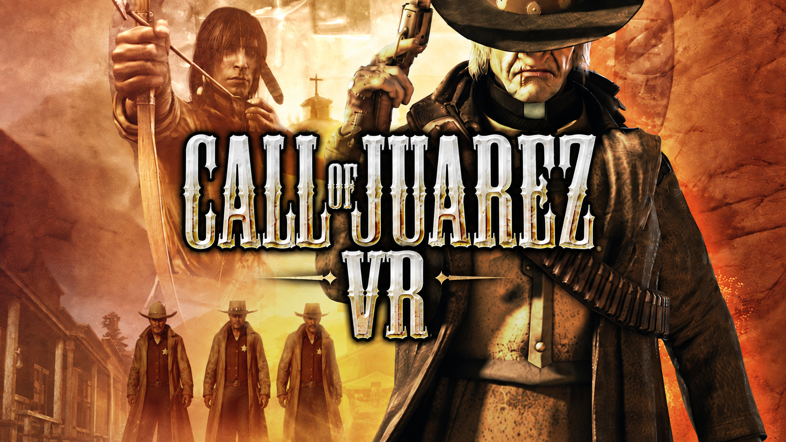

# Call of Juarez VR

<p align="center">
  
</p>

<p align="center">
  
  
  
</p>
<p align="center">
  <a href="https://ko-fi.com/onitaku"></a>
</p>

**An experimental native-PCVR conversion for Techland's Call of Juarez games.**

Call of Juarez (2006) is the reference implementation. The goal is a native-feeling VR conversion with stereo rendering from the game engine, tracked head and hands, full-body integration and interactions rebuilt around motion controllers.

> **Pre-alpha — no public release yet.** Native stereo and the core HMD path are working in-headset. Current development is focused on the remaining playability and comfort blockers before the first backend can be considered usable end to end.

## Current state

Current evidence as of **2026-10-01**, for the inspected Steam build and tested
PS VR2 / SteamVR host:

| Area | Accepted state and remaining limit |
| --- | --- |
| Native stereo and HMD | **Live-tested / headset-validated** real per-eye rendering, 6DoF head movement, positional offset and recentering. Correct stereo depth and stable head turns are confirmed. |
| Startup and transport | **Live-tested** D3D9Ex compatibility, flat videos/menu presentation and GPU-resident native eye transport through private D3D11 into OpenVR, with explicit render-pose submission. Native CPU readback is removed on this path. |
| Refresh and shutdown | **Live-tested** bounded HMD-derived rate cap at the configured 90 Hz and complete normal-quit copy drain / same-owner OpenVR shutdown. Sustained tail latency, refresh-change recovery and abnormal lifecycle remain open. |
| Locomotion | Physical measurements confirm vanilla-equivalent movement and jump behavior. |
| Menu pointer | Windows cursor injection remains **physically rejected**, including held-button activation. Automatic laser delivery to the internal game cursor and temporary mouse priority are **implemented / host-tested**; accurate hover/selection in the headset is the current gate. |
| Body and weapons | Sense tracking reaches the game-specific layer, but continuous arm/body IK is **visually rejected** and weapon/barrel alignment remains unaccepted. |

The rate cap follows the headset property, rather than a fixed 90 Hz setting.
The accepted bounded run produced about 87 stereo pairs/s and 89 total
submissions/s; this does not establish 90 fresh frames/s or phase-lock.

The menu candidate shows the laser **automatically while pointing**, with no
L1/R1 requirement. **Same-hand L2/R2 selects**; a fresh trigger on the other hand
chooses that ray. Moving or dragging the physical mouse gives it priority until
1.5 seconds after the latest activity. Cross accepts and Circle goes back.
Accurate highlighting, selection and mouse coexistence still need the headset test.
Pending-frame renderer reset/device loss and abnormal shutdown remain separate
from the accepted normal-quit path.

[Validation](docs/VALIDATION.md) records the durable physical acceptance state. Per-run logs, videos, telemetry, agent handoffs and temporary evidence remain local under ignored working directories.

## Games

| Game | Project state |
| --- | --- |
| **Call of Juarez (2006)** | Active reference implementation and current physical-test target. |
| **Call of Juarez: Bound in Blood** | Planned. No Chrome Engine assumptions are promoted until the reference backend is mature enough to justify reuse. |
| **Call of Juarez: Gunslinger** | Planned. Game-specific work has not started. |

## Documentation

[Roadmap](docs/ROADMAP.md) ·
[Architecture](docs/ARCHITECTURE.md) ·
[Validation](docs/VALIDATION.md)

Focused exact-game research:
[camera/stereo](docs/research/COJ_CAMERA_PATH.md) ·
[arm/weapon ownership](docs/research/COJ_ARM_SKINNING_AND_AIM.md) ·
[D3D9 resource census](docs/research/COJ_D3D9_RESOURCE_CENSUS.md)

The README is intentionally a project landing page. Detailed run chronology and temporary implementation handoffs are not versioned as project documentation.

<details>
<summary><strong>Development</strong></summary>

Native targets are Windows/x86. Development currently requires Visual Studio 2022 / Build Tools with C++ support and CMake 3.25+.

```powershell
cmake --preset win32-debug
cmake --build --preset debug
ctest --preset debug
```

For a physical candidate use `tools/vr_test.ps1`. SteamVR and Call of Juarez are launched manually. Read [AGENTS.md](AGENTS.md) before changing runtime integration or promoting validation state.

</details>

## Disclaimer

Call of Juarez VR is an unofficial community project and is not affiliated with or endorsed by Techland, Ubisoft, Valve or Sony Interactive Entertainment.
